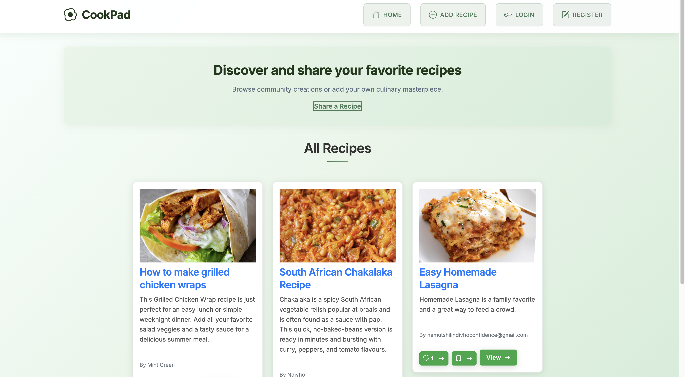

# CookPad – Recipe Sharing App

CookPad is a **full-stack recipe sharing application** built with:

* **Frontend**: Angular
* **Backend**: Node.js + Express
* **Database**: MongoDB

Users can **browse, share, edit, and delete recipes**.

---

## Features

* User authentication (JWT-based)
* Add, edit, delete recipes
* View recipe details and comments
* Responsive UI with Angular
* RESTful API with Node.js & Express
* MongoDB for recipe + user storage

---

## Project Structure

```
CookPad/
│── frontend/       # Angular app
│   ├── src/        
│   └── package.json
│
│── backend/        # Node.js + Express + MongoDB app
│   ├── src/
│   │   ├── models/       # Mongoose schemas
│   │   ├── routes/       # Express routes
│   │   ├── controllers/  # API logic
│   │   └── server.js     # App entry point
│   └── package.json
│
└── README.md
```

---

## Installation

### 1️⃣ Clone the Repository

```bash
git clone https://github.com/your-username/CookPad.git
cd CookPad
```

### 2️⃣ Backend Setup (Node.js + MongoDB)

```bash
cd backend
npm install
```

* Create a `.env` file inside `backend/` with:

```
PORT=5000
MONGO_URI=mongodb://localhost:27017/cookpad
JWT_SECRET=your_secret_key
```

* Run backend server:

```bash
npm run dev
```

Backend will run on: `http://localhost:5000`

---

### 3️⃣ Frontend Setup (Angular)

```bash
cd frontend
npm install
```

* Update `src/environments/environment.ts` with backend API URL:

```ts
export const environment = {
  production: false,
  apiUrl: 'http://localhost:5000/api'
};
```

* Run Angular frontend:

```bash
ng serve
```

Frontend will run on: `http://localhost:4200`

---

## API Endpoints

### Authentication

* `POST /api/auth/register` – Register new user
* `POST /api/auth/login` – Login user

### Recipes

* `GET /api/recipes` – Get all recipes
* `GET /api/recipes/:id` – Get recipe by ID
* `POST /api/recipes` – Create new recipe
* `PUT /api/recipes/:id` – Update recipe
* `DELETE /api/recipes/:id` – Delete recipe

---

## Tech Stack

**Frontend**: Angular
**Backend**: Node.js
**Database**: MongoDB + Mongoose

---

## Screenshots


---

## Contributing

1. Fork the repo
2. Create a new branch (`git checkout -b feature/your-feature`)
3. Commit changes (`git commit -m "Add your feature"`)
4. Push branch (`git push origin feature/your-feature`)
5. Open a Pull Request

---

## License

This project is licensed under the **MIT License**.

