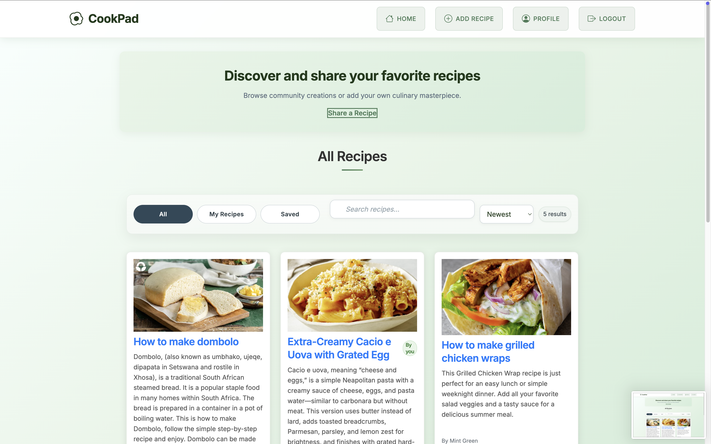

# CookPad – Recipe Sharing App

CookPad is a **full-stack recipe sharing application** built with:

* **Frontend**: Angular
* **Backend**: Node.js + Express
* **Database**: MongoDB

Users can **browse, edit, and delete recipes**.

---

## Features

* User authentication (JWT-based)
* Add, edit, delete recipes
* View recipe details and comments
* Responsive UI with Angular
* RESTful API with Node.js & Express
* MongoDB for recipe + user storage

---

## Project Structure

```
CookPad/
│── frontend/       # Angular app
│   ├── src/        
│   └── package.json
│
│── backend/        # Node.js + Express + MongoDB app
│   ├── src/
│   │   ├── models/       # Mongoose schemas
│   │   ├── routes/       # Express routes
│   │   ├── controllers/  # API logic
│   │   └── server.js     # App entry point
│   └── package.json
│
└── README.md
```

---

## Installation

### 1️⃣ Clone the Repository

```bash
git clone https://github.com/your-username/CookPad.git
cd CookPad
```

### 2️⃣ Backend Setup (Node.js + MongoDB)

```bash
cd backend
npm install
```

* Create a `.env` file inside `backend/` with:

```
PORT=5000
MONGO_URI=mongodb://localhost:27017/cookpad
JWT_SECRET=your_secret_key
```

* Run backend server:

```bash
npm run dev
```

Backend will run on: `http://localhost:5000`

---

### 3️⃣ Frontend Setup (Angular)

```bash
cd frontend
npm install
```

* Update `src/environments/environment.ts` with backend API URL:

```ts
export const environment = {
  production: false,
  apiUrl: 'http://localhost:5000/api'
};
```

* Run Angular frontend:

```bash
ng serve
```

Frontend will run on: `http://localhost:4200`

---

## API Endpoints

### Authentication

* `POST /api/auth/register` – Register new user
* `POST /api/auth/login` – Login user

### Recipes

* `GET /api/recipes` – Get all recipes
* `GET /api/recipes/:id` – Get recipe by ID
* `POST /api/recipes` – Create new recipe
* `PUT /api/recipes/:id` – Update recipe
* `DELETE /api/recipes/:id` – Delete recipe

---

## Tech Stack

**Frontend**: Angular
**Backend**: Node.js
**Database**: MongoDB + Mongoose

---

## Screenshots


---

## Contributing

1. Fork the repo
2. Create a new branch (`git checkout -b feature/your-feature`)
3. Commit changes (`git commit -m "Add your feature"`)
4. Push branch (`git push origin feature/your-feature`)
5. Open a Pull Request

---

## License

This project is licensed under the **MIT License**.


---

## Deploying to Vercel

This project is structured as two Vercel projects: one for the backend (serverless API) and one for the frontend (Angular static site).

### 1) Backend (serverless API)

- Root Directory: `backend/`
- Entry: `api/index.js` (wraps the Express app from `server.js`)
- Config: `backend/vercel.json`
- Environment Variables (required in Vercel Project Settings → Environment Variables):
  - `MONGO_URI` → Your MongoDB connection string
  - `JWT_SECRET` → Any strong random string

Steps:
1. Import the repository into Vercel.
2. When prompted, set Root Directory to `backend/`.
3. Add the environment variables above.
4. Deploy and note the deployment URL (e.g., `https://your-backend.vercel.app`).

Notes:
- The Express server is exported in `backend/server.js` and only listens when run locally, which is required for Vercel Functions.
- CORS is configured to reflect the request origin so it works on Vercel domains and localhost.

### 2) Frontend (Angular static site)

- Root Directory: `frontend/`
- Build Command: `npm run build`
- Output Directory: `dist/frontend`
- Config: `frontend/vercel.json`

Steps:
1. Create a new Vercel project pointing to the same repo, but set Root Directory to `frontend/`.
2. Before deploying, update `frontend/vercel.json` rewrites to point to your backend URL:
   - `/api/:match*` → `https://your-backend.vercel.app/api/:match*`
   - `/uploads/:match*` → `https://your-backend.vercel.app/uploads/:match*`
3. Deploy the frontend.

### Local Development

- Backend: `cd backend && npm run dev` (http://localhost:5050)
- Frontend: `cd frontend && npm start` or `ng serve` (http://localhost:4200)
- The Angular services pick `http://localhost:5050` automatically when running on localhost, and use relative paths in production.

### Image Uploads on Vercel (Important)

Vercel serverless filesystem is ephemeral; files saved to disk (e.g., `uploads/`) will not persist. Choose a persistent storage provider and integrate it into the upload route:

- Cloudinary (simple setup, great developer experience)
- Vercel Blob (native to Vercel)
- AWS S3 (flexible and widely used)

Reach out or open an issue if you want this repository configured for one of the providers above; changes include backend route updates, new environment variables, and minor frontend adjustments.

